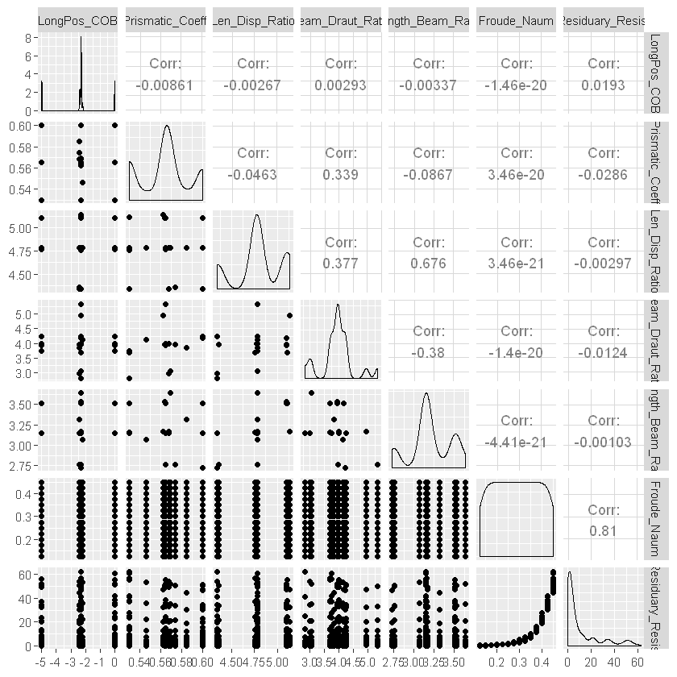

# ANN

인간의 뇌를 구성하고 있는 뉴런의 동작을 모형화한 것

### 구성
* Input Layer : 외부로부터 입력자료를 받아들임
* Hidden Layer : 앞에서 전달받은 데이터에 대해 가중치(중요도)를 고려해 합산한 후 다음 층으로 전달
* Output Layer : 출력값 산출
* node : 하나의 층을 이루는 것들.
    * 노드는 weight와 input value의 곱으로 활성함수(activation function)를 통해 다음 노드에 전달됨
   

#### Hidden Layer를 쓰는 이유
*  은닉층을 설정하면 정확도가 증가하여 패턴 인식 수준이 올라간다. 
* 은닉층은 모든 입력노드로부터 입력값을 받아 가중합을 계산하고 이 값을 전이함수에 적용하여 출력층에 전달하게 되는데 이 가중치는 연결 강도로 표현되며 초기에 주어졌다가 예측값을 가장 잘 맞추는 값으로 조정된다. 따라서 복잡한 자료들의 분석을 위해서는 좀 더 세련되고 예측력을 높이는 모델이 필요하기 때문에 은닉층을 설정한다.  (참고로 은닉층이 사라지면 가중합의 전이함수로의 적용이 없어지면서 대표적인 통계모형인 회귀모델과 같은 알고리즘이 도출된다. )

#### 적절한 Hidden Layer의 갯수
* 은닉층이 너무 많으면 가중치가 많아져서 과대 적합 문제가 발생하고, 너무 적으면 과소 적합 문제가 발생한다. 
* 범용근사자(universal approximator) : 은닉층이 하나로 구성된 신경망 ==> 많이 쓰인다.
* 은닉 노드의 수를 결정할 때는 적절히 큰 값으로 놓고 가중치를 감소시키면서 적용하는 것이 좋다고 하며, 다수의 반복실험을 통해 사용자가 적절하게 설정해나가야 한다.

#### 데이터 별로 어떤 activate function이 적합한가?

* **ReLu함수**: 입력이 0을 넘으면 그 입력을 그대로 출력하고, 0 이하면 0을 출력하는 함수
    - 0이하의 값들은 무시.
    - ==> 2개를 분류하는 문제일 때 ReLu함수를 사용한다.
- **Maxout**: 이 함수는 두 개의 선형 함수에 max함수를 덮어 씌운 형태로 Max(w1x+b1, w2x+b2) 꼴이다
     - ReLu와 Sigmoid와 달리 maxout 내의 w1, w2, b1, b2를 결정하는 학습을 필요로 한다.
     - 또한 다른 활성 함수를 사용하는 것보다 maxout을 사용하는 것이 model averaging의 효과를 극대화 시킬 수 있다.
     - 과적합에 있어 ReLu를 사용하는 것보다 훨씬 효과적이라고 한다.
* **항등함수(identity function)**: 양극성이며 선형연속인 함수.
    - 항등함수를 활성화함수로 사용하면 입력의 가중합이 그대로 출력된다.
* **경사함수(ramp function)**: 단극성이며 선형연속인 함수. 
    - 경사함수를 활성화 함수로 사용하면 입력값이 0보다 작을 경우에는 0값이 출력된다
    - 0보다 크거나 같을 경우에는 입력값이 그대로 출력된다.

이외에도 하이퍼볼릭탄젠트 함수, 소프트플러스 함수, 렉티파이어 함수 등이 있다.
 

#### 데이터가 선형분류가 불가능할 때 인공신경망을 어떤 방식으로 만드는지 서술하세요

* 단순 퍼셉트론(신경망을 이루는 가장 중요한 기본 단위, 작은 신경망)
    * 뉴런이 ‘발화한다/ 안한다’라는 두 가지 패턴을 분류한다.
    * ==> 데이터를 두 클래스로 분류하는 ‘이진 분류’만 가능하고 ‘다중 클래스 분류’는 실행할 수 없다.
    * 이때 활성화 함수의 모양을 시그모이드가 아닌 형태로 바꾸고 소프트맥스(softmax)함수를 사용하면 가능하다.

*  커널트릭을 사용해서 단순히 인풋 데이터를 변형하기만 해도 몇몇 형태의 곡선적 데이터는 성공적으로 분류할 수 있다. 
    * 그러나 커널 트릭은 근본적인 해결책은 되지 못한다. 
    * 분류기의 형태는 여전히 단순 선형조합만으로 표현되므로, 커널 트릭으로 해결할 수 있는 곡선적 분류 문제는 극히 일부이다. 
    * 따라서 모든 경우에도 높은 성능을 내는 비선형 분류기를 구현할 필요가 있다.

 *  은닉층을 두어 유리한 새로운 특징 공간으로 변환한다(다층 퍼셉트론의 공간 변환 능력).
    * 그 후에 시그모이드 활성함수를 도입하여 출력이 연속값으로 만든다.
    * 또한 오류 역전파 알고리즘을 사용하여 한 층씩 그레이디언드를 계산하고 가중치를 갱신한다. 


    
## 알고리즘 종류
#### 다중퍼셉트론
입력층과 출력층 사이에 다수의 은닉층이 존재

### 전방 전달 신경망(Feedforward neural network)
가장 간단한 방법의 인공신경망 방법이다. 신경망 정보가 입력 노드에서 은닉노드를 거쳐 출력 노드까지 전달 되며 순환 경로가 존재하지 않는 그래프를 형성한다. 다양한 방법의 구조가 존재하는데 이진 구조, 퍼셉트론, 시그모이드 등등 여러가지 방법으로 구성 할 수 있다.

### 방사 신경망(Radial basis function network)
방사상 인공 신경망은 다차원의 공간의 보간법에 매우 강력한 능력을 가지고 있다. 방사 함수는 다 계층의 시그모이드 함수를 은닉 노드에서 사용하는 형태를 대체할 수 있다.

### 코헨 자기조직 신경망(kohonen self-organizing network)
자기조직 신경망 알고리즘은 대표적인 신경망 알고리즘중 하나로 대부분의 신경망 알고리즘이 지도(supervised) 학습방법을 사용하는 것과는 대조적으로 자율(unsupervised) 학습방법과 경쟁(competitive) 학습방법을 사용한다. 신경망은 입력층과 경쟁층으로 나뉘고, 경쟁층의 각 뉴런은 연결강도 백터와 입력백터가 얼마나 가까운가를 계산한다. 그리고 각 뉴런들은 학습할 수 있는 특권을 부여 받으려고 서로 경쟁하는데 거리가 가장 가까운 뉴런이 승리하게 된다. 이 승자 뉴런이 출력신호를 보낼 수 있는 유일한 뉴런이다. 또한 이 뉴런과 이와 인접한 이웃 뉴런들만이 제시된 입력 백터에 대하여 학습이 허용된다.

### 순환 인공 신경망(Recurrent neural network)
순환 인공 신경망은 전방 신경망과 정 반대의 동작을 한다. 노드들 간의 양방향 데이터 이동이하며 데이터는 선형적으로 전달이 된다. 데이터가 후방 노드에서 전방노드로 전달하여 연산이 수행될 수 도 있다.

### example : 요트의 정보들을 가지고 신경망으로 Residuary_Resist에 대해 예측


```R
yacht = read.csv('yacht.csv', header=T)
str(yacht) #308 obs, 7 vars, all numeric values.
```

    'data.frame':	308 obs. of  7 variables:
     $ LongPos_COB      : num  -2.3 -2.3 -2.3 -2.3 -2.3 -2.3 -2.3 -2.3 -2.3 -2.3 ...
     $ Prismatic_Coeff  : num  0.568 0.568 0.568 0.568 0.568 0.568 0.568 0.568 0.568 0.568 ...
     $ Len_Disp_Ratio   : num  4.78 4.78 4.78 4.78 4.78 4.78 4.78 4.78 4.78 4.78 ...
     $ Beam_Draut_Ratio : num  3.99 3.99 3.99 3.99 3.99 3.99 3.99 3.99 3.99 3.99 ...
     $ Length_Beam_Ratio: num  3.17 3.17 3.17 3.17 3.17 3.17 3.17 3.17 3.17 3.17 ...
     $ Froude_Naum      : num  0.125 0.15 0.175 0.2 0.225 0.25 0.275 0.3 0.325 0.35 ...
     $ Residuary_Resist : num  0.11 0.27 0.47 0.78 1.18 1.82 2.61 3.76 4.99 7.16 ...
    


```R
library(GGally)
ggpairs(yacht) #correlation 
```

    Warning message:
    "package 'GGally' was built under R version 3.5.3"Loading required package: ggplot2
    





```R
normalize=function(x) { 
return((x-min(x)) / (max(x)-min(x)))
}
library(dplyr)
yacht_norm2=mutate_all(yacht, normalize)
yacht_norm=as.data.frame(lapply(yacht, normalize)) 
```


```R
summary(yacht$Residuary_Resist) 
```


       Min. 1st Qu.  Median    Mean 3rd Qu.    Max. 
     0.0100  0.7775  3.0650 10.4954 12.8150 62.4200 


```R
summary(yacht_norm$Residuary_Resist) # 평균이 거의 0에 가까움
```


       Min. 1st Qu.  Median    Mean 3rd Qu.    Max. 
    0.00000 0.01230 0.04895 0.16801 0.20518 1.00000 


```R
summary(yacht_norm2$Residuary_Resist) # 평균이 거의 0에 가까움
```


       Min. 1st Qu.  Median    Mean 3rd Qu.    Max. 
    0.00000 0.01230 0.04895 0.16801 0.20518 1.00000 


```R
N=nrow(yacht_norm) ; N
yacht_train=yacht_norm[1:(N*0.75), ]
yacht_test=yacht_norm[(N*0.75+1):N, ]
```


308


```R
library(neuralnet)
str(yacht)
yacht_model=neuralnet(Residuary_Resist ~ LongPos_COB + Prismatic_Coeff + Len_Disp_Ratio + 
Beam_Draut_Ratio + Length_Beam_Ratio + Froude_Naum, data= yacht_test) #default hidden node = 1
```

    Warning message:
    "package 'neuralnet' was built under R version 3.5.3"
    Attaching package: 'neuralnet'
    
    The following object is masked from 'package:dplyr':
    
        compute
    
    

    'data.frame':	308 obs. of  7 variables:
     $ LongPos_COB      : num  -2.3 -2.3 -2.3 -2.3 -2.3 -2.3 -2.3 -2.3 -2.3 -2.3 ...
     $ Prismatic_Coeff  : num  0.568 0.568 0.568 0.568 0.568 0.568 0.568 0.568 0.568 0.568 ...
     $ Len_Disp_Ratio   : num  4.78 4.78 4.78 4.78 4.78 4.78 4.78 4.78 4.78 4.78 ...
     $ Beam_Draut_Ratio : num  3.99 3.99 3.99 3.99 3.99 3.99 3.99 3.99 3.99 3.99 ...
     $ Length_Beam_Ratio: num  3.17 3.17 3.17 3.17 3.17 3.17 3.17 3.17 3.17 3.17 ...
     $ Froude_Naum      : num  0.125 0.15 0.175 0.2 0.225 0.25 0.275 0.3 0.325 0.35 ...
     $ Residuary_Resist : num  0.11 0.27 0.47 0.78 1.18 1.82 2.61 3.76 4.99 7.16 ...
    


```R
plot(yacht_model) # error(SSE)=0.013896 , steps = 1556
```


```R
model_results= compute(yacht_model, yacht_test[-7]) 
predicted_resist = model_results$net.result
head(predicted_resist)
head(yacht_test$Residuary_Resist)
cor(predicted_resist, yacht_test$Residuary_Resist) # cor=0.9970
```


<table>
<tbody>
	<tr><th scope=row>232</th><td>0.05767609</td></tr>
	<tr><th scope=row>233</th><td>0.09395969</td></tr>
	<tr><th scope=row>234</th><td>0.15029929</td></tr>
	<tr><th scope=row>235</th><td>0.23618739</td></tr>
	<tr><th scope=row>236</th><td>0.36351972</td></tr>
	<tr><th scope=row>237</th><td>0.54469720</td></tr>
</tbody>
</table>


<ol class=list-inline>
	<li>0.0809165197884954</li>
	<li>0.11424451209742</li>
	<li>0.165838807883352</li>
	<li>0.244191635955776</li>
	<li>0.370773914436789</li>
	<li>0.554558564332639</li>
</ol>


<table>
<tbody>
	<tr><td>0.9964816</td></tr>
</tbody>
</table>


```R
yacht_model2=neuralnet(Residuary_Resist ~ LongPos_COB + Prismatic_Coeff + Len_Disp_Ratio + 
Beam_Draut_Ratio + Length_Beam_Ratio + Froude_Naum, 
data= yacht_test,hidden = 5)
plot(yacht_model2) # error=0.006811, steps=1404 
```


```R
model_results2=compute(yacht_model2, yacht_test[-7])
predicted_resist2 = model_results2$net.result
cor(predicted_resist2, yacht_test$Residuary_Resist) # cor=0.9986 -> better result. 
```


<table>
<tbody>
	<tr><td>0.9985714</td></tr>
</tbody>
</table>


```R

```


```R

```


```R

```
