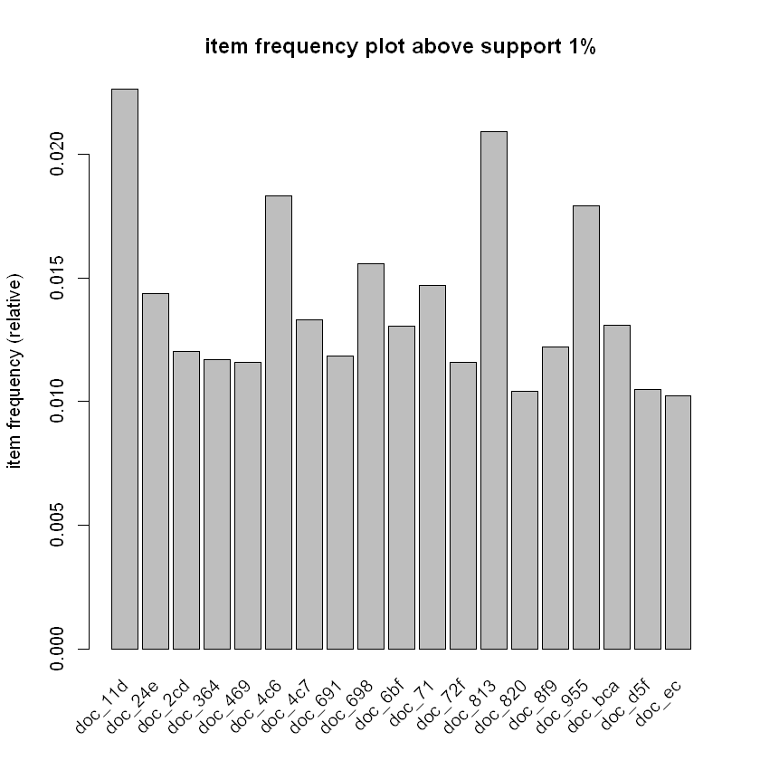
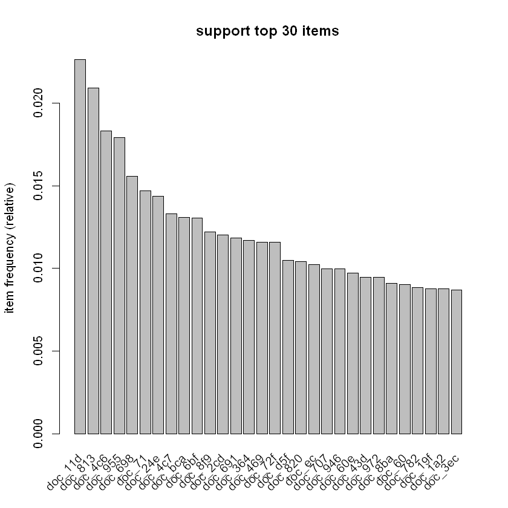
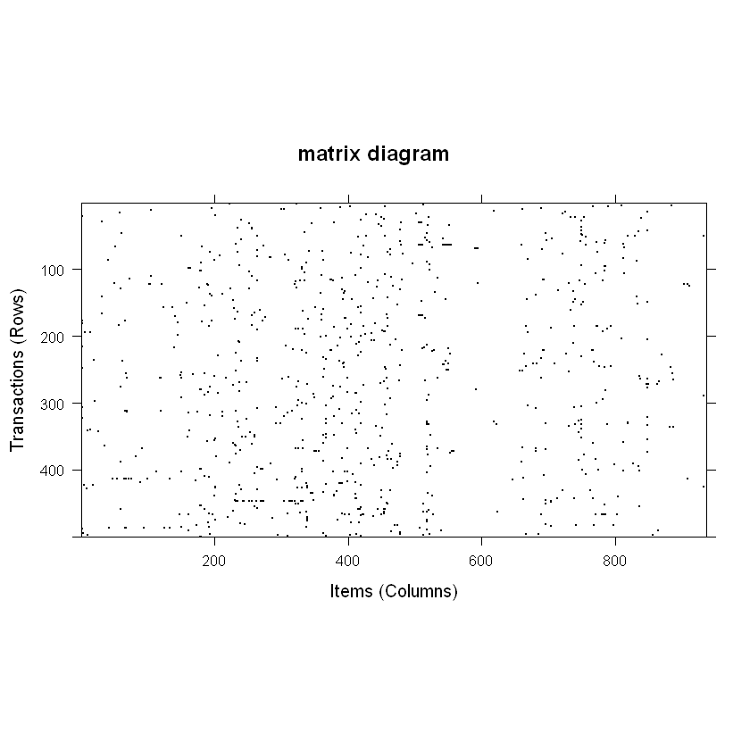

# association rule

Unsupervised Learning


* support : 전체 데이터 내에서 해당 데이터가 차지하는 비율을 알려준다. 
    * support가 높을 수록 데이터 내의 빈도가 높다고 할 수 있다. X 하나의 support는 support(X)= count(X)/N로 구하고, X와 Y 에 관한 support는 support(X,Y)=P(X,Y)로 구할 수 있다.
* confidence(X->Y) : X를 구매했을 때 Y도 같이 구매한 비율을 뜻한다.
    * confidence가 높을수록 X와 Y의 연관성이 높다고 볼 수 있다. 
    * confidence(X->Y)는 support(X,Y)/support(X)로 구할 수 있으며 이는 조건부확률 P(Y|X)와 같다.
    * 높을 수록 유용한 규칙일 가능성 높다고 할 수 있습니다.
* lift(X->Y) : 하나만 구매한 거래에 비해 X와 Y를 같이 구매한 거래가 어느정도인지에 대한 비율을 뜻한다.
    * lift(X->Y)는 confidence(X->Y) / support(Y)로 구할 수 있으며 이는 P(Y|X)/P(Y)와 같다.
    * Lift가 1이면 독립이라고 가정했을 때 실제 빈도가 동일하다는 것으로 X와 Y 사이에 어떠한 관계도 존재하지 않고 우연의 일치로 발생했다고 생각할 수 있다.
    * Lift < 1이면 X와 Y가 동시에 일어나는 경우는 없다는 것을 의미한다. 
    * Lift > 1 이면 X와 Y가 서로 의존적이고 관련이 있어 동시에 일어나는 경우가 있다는 것을 의미한다. 

### example
* data : Vienna University of Economics and Business Administration에서의 2003~2008년까지 기간 동안 전자책 다운로드 이력/거래 데이터


```R
library(arules)


help(Epub)
data("Epub")
summary(Epub)

```

    Warning message:
    "package 'arules' was built under R version 3.5.3"Loading required package: Matrix
    Warning message:
    "package 'Matrix' was built under R version 3.5.3"
    Attaching package: 'arules'
    
    The following objects are masked from 'package:base':
    
        abbreviate, write
    
    


    transactions as itemMatrix in sparse format with
     15729 rows (elements/itemsets/transactions) and
     936 columns (items) and a density of 0.001758755 
    
    most frequent items:
    doc_11d doc_813 doc_4c6 doc_955 doc_698 (Other) 
        356     329     288     282     245   24393 
    
    element (itemset/transaction) length distribution:
    sizes
        1     2     3     4     5     6     7     8     9    10    11    12    13 
    11615  2189   854   409   198   121    93    50    42    34    26    12    10 
       14    15    16    17    18    19    20    21    22    23    24    25    26 
       10     6     8     6     5     8     2     2     3     2     3     4     5 
       27    28    30    34    36    38    41    43    52    58 
        1     1     1     2     1     2     1     1     1     1 
    
       Min. 1st Qu.  Median    Mean 3rd Qu.    Max. 
      1.000   1.000   1.000   1.646   2.000  58.000 
    
    includes extended item information - examples:
       labels
    1 doc_11d
    2 doc_13d
    3 doc_14c
    
    includes extended transaction information - examples:
          transactionID           TimeStamp
    10792  session_4795 2003-01-02 10:59:00
    10793  session_4797 2003-01-02 21:46:01
    10794  session_479a 2003-01-03 00:50:38


```R
itemFrequency(Epub[, 10]) # 10번째 책의 frequency
```


<strong>doc_156:</strong> 0.00311526479750779


```R
epub.freq<-itemFrequency(Epub)
epub.freq[which(epub.freq==max(epub.freq))] # 가장 많이 빌려진 책은 doc_11d
```


<strong>doc_11d:</strong> 0.0226333524063831


support=0.01 이상인 아이템들에 대해 plot


```R
itemFrequencyPlot(Epub, support = 0.01, main = "item frequency plot above support 1%") 
```





support가 제일 높은 상위 30개 아이템들에 대해 plot


```R
itemFrequencyPlot(Epub, topN = 30, main = "support top 30 items")
```





500개의 sample을 뽑아서 sparse matrix를 그리기 (데이터가 충분하므로 복원추출 할 필요는 없습니다)


```R
image(sample(Epub, 500, replace = FALSE), main = "matrix diagram")
```





apriori 알고리즘으로 support가 0.001이상이고 confidence가 0.2이상이고 최소길이가 2인 규칙들을 만들기


```R
epub.rules <- apriori(data = Epub, 
parameter = list(support = 0.001,
confidence = 0.20,minlen = 2))
```

    Apriori
    
    Parameter specification:
     confidence minval smax arem  aval originalSupport maxtime support minlen
            0.2    0.1    1 none FALSE            TRUE       5   0.001      2
     maxlen target   ext
         10  rules FALSE
    
    Algorithmic control:
     filter tree heap memopt load sort verbose
        0.1 TRUE TRUE  FALSE TRUE    2    TRUE
    
    Absolute minimum support count: 15 
    
    set item appearances ...[0 item(s)] done [0.00s].
    set transactions ...[936 item(s), 15729 transaction(s)] done [0.01s].
    sorting and recoding items ... [481 item(s)] done [0.00s].
    creating transaction tree ... done [0.00s].
    checking subsets of size 1 2 3 done [0.00s].
    writing ... [65 rule(s)] done [0.00s].
    creating S4 object  ... done [0.00s].
    

lift순으로 정렬해본 뒤 맨 첫번째 규칙에 대해 해석


```R
epub.rules.sorted <-sort(epub.rules, by = "lift")
inspect(epub.rules.sorted[1])
```

        lhs                  rhs       support     confidence lift   count
    [1] {doc_6e7,doc_6e8} => {doc_6e9} 0.001080806 0.8095238  454.75 17   
    

1. support를 보면, 전체의 약 0.1%의 사람들이 6e7, 6e8, 6e9 세 책을 모두 빌린 적이 있다.

2. confidence를 보면, 6e7, 6e8을 빌린 사람들 중 약 81%는 6e9도 빌린 적이 있다.

3. lift를 보면, 어떤 사람이 단순히 6e9를 빌릴 확률보다, 6e7, 6e8을 빌린 사람이 6e9도 함께 빌릴 확률이 약 454.75배 높은 것을 알 수 있다.

4. count를 보면, 사람들이 책들을 빌린 모든 경우 중에 6e7, 6e8, 6e9을 모두 빌린 경우는 17번임을 알 수 있다. 15729*0.001080806=17


doc_6e7, doc_6e8, doc_6e9에 강한 상관관계가 보이므로, 이들만 포함하는 규칙을 출력한다.


```R
epub.rule.interest <- subset(epub.rules, items %in% c("doc_72f", "doc_4ac"))
inspect(epub.rule.interest)
```

        lhs          rhs       support     confidence lift     count
    [1] {doc_4bf} => {doc_4ac} 0.001080806 0.5000000  77.10294 17   
    [2] {doc_4ac} => {doc_16e} 0.002797381 0.4313725  53.42566 44   
    [3] {doc_16e} => {doc_4ac} 0.002797381 0.3464567  53.42566 44   
    [4] {doc_72f} => {doc_813} 0.004068917 0.3516484  16.81178 64   
    

doc_87c 라는 책이 좌변에 있는 규칙들만 출력


```R
epub.rules.interest.lhs <- subset(epub.rules, lhs %in% "doc_87c")
inspect(epub.rules.interest.lhs)

```

        lhs          rhs       support     confidence lift     count
    [1] {doc_87c} => {doc_882} 0.001335113 0.6        171.5891 21   
    

"doc_6e8", "doc_6e9" 라는 책 둘다 좌변에 있는 규칙들만 출력


```R
epub.rules.interest.lhs.ain <- subset(epub.rules, lhs %ain% c("doc_6e8", "doc_6e9"))
inspect(epub.rules.interest.lhs.ain)
```

        lhs                  rhs       support     confidence lift     count
    [1] {doc_6e8,doc_6e9} => {doc_6e7} 0.001080806 0.8947368  402.0947 17   
    

책 코드로 60e를 포함하고 confidence가 .25이상인 규칙들만 출력


```R
epub.rules.interest.pin.conf <- subset(epub.rules, items %pin% c("60e") & confidence > 0.25)
inspect(epub.rules.interest.pin.conf)
```

        lhs          rhs       support     confidence lift     count
    [1] {doc_60e} => {doc_6bf} 0.002670227 0.2745098  21.06227 42   
    

참고) %pin%이랑 %in%이랑 뭐가 다를까여?
* pin : partial subset- 그 문자열을 포함하는게 있는 거
* in : 그 문자열에 해당하는게 통째로 있는 거

#### 시각화 (패키지 문제로 안돌아감)


```R
library(jsonlite)
library(arulesViz)
```

    Warning message:
    "package 'arulesViz' was built under R version 3.5.3"


    Error: package or namespace load failed for 'arulesViz' in loadNamespace(j <- i[[1L]], c(lib.loc, .libPaths()), versionCheck = vI[[j]]):
     namespace 'jsonlite' 1.5 is already loaded, but >= 1.6 is required
    Traceback:
    

    1. library(arulesViz)

    2. tryCatch({
     .     attr(package, "LibPath") <- which.lib.loc
     .     ns <- loadNamespace(package, lib.loc)
     .     env <- attachNamespace(ns, pos = pos, deps)
     . }, error = function(e) {
     .     P <- if (!is.null(cc <- conditionCall(e))) 
     .         paste(" in", deparse(cc)[1L])
     .     else ""
     .     msg <- gettextf("package or namespace load failed for %s%s:\n %s", 
     .         sQuote(package), P, conditionMessage(e))
     .     if (logical.return) 
     .         message(paste("Error:", msg), domain = NA)
     .     else stop(msg, call. = FALSE, domain = NA)
     . })

    3. tryCatchList(expr, classes, parentenv, handlers)

    4. tryCatchOne(expr, names, parentenv, handlers[[1L]])

    5. value[[3L]](cond)

    6. stop(msg, call. = FALSE, domain = NA)


(lift순으로 정렬된 규칙 기준) 상위 20개의 그룹화된 매트리스를 그려보세요


```R
plot(epub.rules.sorted[1:20], method = "grouped")

```


    Error in plot.associations(epub.rules.sorted[1:20], method = "grouped"): Needed package 'arulesViz' not installed or loaded!
    Traceback:
    

    1. plot(epub.rules.sorted[1:20], method = "grouped")

    2. plot.associations(epub.rules.sorted[1:20], method = "grouped")

    3. stop("Needed package 'arulesViz' not installed or loaded!")


```R


## 시각화

library(arulesViz)


# (2)-12 (lift순으로 정렬된 규칙 기준) graph로 그려보되, items를 중심으로 그려보세요
plot(epub.rules.sorted, method = "graph", control = list(type="items"))

# (2)-13 (lift순으로 정렬된 규칙 기준) csv 파일로 저장해보세요
write(epub.rules,
file = "epub.rules.csv",
sep = ",",
quote = TRUE,
row.names = FALSE)


# changing font size(vertex.label.cex), arrow
plot(epub.rules, method = "graph",
control = list(type="items"),
vertex.label.cex = 0.7, 
edge.arrow.size = 0.3,
edge.arrow.width = 2)


plot(epub.rules[55:65], method="graph", control=list(type="itemsets"))


# saving in CSV format : write()
write(epub.rules,
file = "epub.rules.csv",
sep = ",",
quote = TRUE,
row.names = FALSE)


# transforming into dataframe
epub.rules.df <- as(epub.rules, "data.frame")


# 교차지지도도
# IS(Interest-Support) measure = sqrt(lift(A,B)*support(A,B))
epub.rules.df <- transform(epub.rules.df, IS = sqrt(lift*support))
epub.rules.df[order(-epub.rules.df$IS), ][1:10, ]
```
